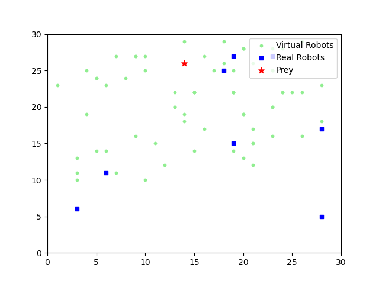

# BSOPredator

## Project Structure

```
│  gridTest.ipynb
│  README.md
│  
├─optim
│  ├─BSO
│  │  │  bso.py
│  │  │  fitness.py
│  │  
│  └─PSO
│     |  fitness.py
│     |  pso.py
│  
├─output
│  |  example.gif
│  
├─prey
│  │  prey.py
│  
└─visual
   │  visual.py
```



